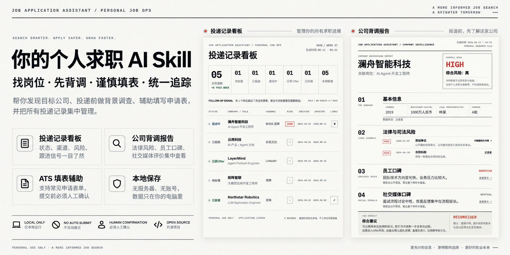
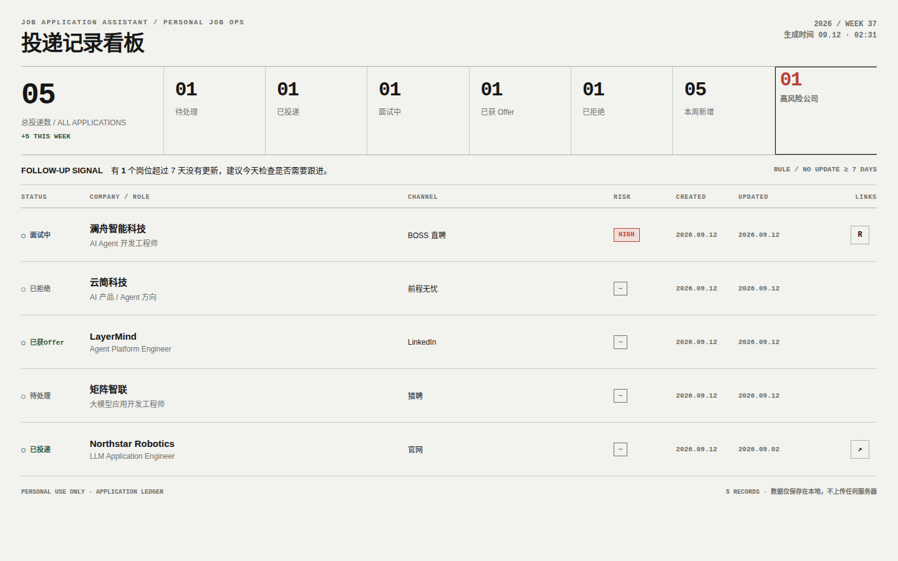
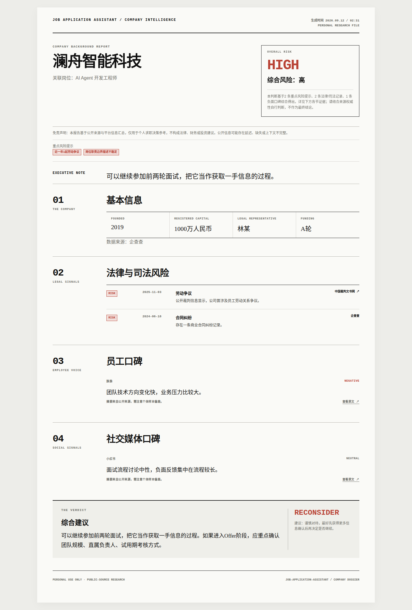

# job-application-assistant

**个人求职 AI Skill｜适用于 Claude / Codex**

*[English](README.en.md)*

<p align="center">
  
</p>

> **一句话看懂：** 让 AI 帮你**发现目标公司 → 投递前做背调 → 谨慎协助填写申请表 → 统一追踪所有投递**，而真正的提交始终由你本人确认。

这是一个给**个人求职者**使用的 Claude / Codex Skill，不是招聘 SaaS。  
没有服务器、没有账号体系、没有云同步；你的投递记录保存在本机 JSON 文件中。

---

## 30 秒看懂怎么用

### 1. 把 Skill 装进 Claude / Codex

- **Claude（桌面端 / Web）**：`Settings → Capabilities → Skills`，上传本项目文件夹或打包后的 `.skill` 文件。
- **Claude Code / Codex**：把本项目放入对应工具的 skills 目录。

### 2. 直接告诉它你想找什么岗位

例如：

```text
帮我寻找 AI Agent 开发相关岗位。
先找正在招聘的公司，优先给出官网招聘页；
准备投递前先做公司背景调查；
我确认后再协助填写申请表，并把投递记录加入看板。
```

### 3. Skill 按流程帮你推进

```text
找岗位
   ↓
确认目标公司
   ↓
公司背调
   ↓
决定是否继续
   ↓
辅助填写申请表
   ↓
你本人确认提交
   ↓
记录投递 + 后续跟进
```

**你不需要每天重复复制岗位信息、手动整理公司风险、再单独维护 Excel。**

---

## 它能帮你做什么

|  | 能力 | 你得到什么 |
|---|---|---|
| 🔎 | **找岗位** | 按岗位关键词寻找正在招聘的公司，并优先定位公司的**官方招聘页** |
| 🏢 | **先背调再投递** | 汇总财务健康度、法律/司法风险、员工口碑和社交媒体公开信息 |
| 📝 | **谨慎辅助填表** | 使用可见浏览器协助填写常见 ATS 表单，如 Greenhouse、Lever、Workday |
| 📊 | **统一追踪投递** | 集中记录公司、岗位、渠道、状态、风险标签与跟进提醒 |
| 🔁 | **避免重复投递** | 投递前检查是否已经申请过同一家公司 |
| 🔒 | **数据本地保存** | 无账号、无服务器、无云同步，求职记录保存在你的电脑里 |

---

## 真实输出长这样

### 投递记录看板

一眼查看所有投递过的公司、当前进度、渠道、更新时间，以及公司背调风险标签。

<p align="center">
  
</p>

### 公司背调报告

在决定是否继续投递或面试之前，把法律/司法风险、员工口碑和社交媒体公开评价集中到一份报告中。

<p align="center">
  
</p>

两个页面都是自包含静态 HTML：不需要服务器，每次运行脚本都会根据你的本地数据重新生成。

---

## 为什么它不是“一键海投工具”

这个项目刻意保留了**人工确认**。

- **不会自动提交申请**：每一批真实投递都必须由你明确确认。
- **不会破解或绕过验证码**：遇到 CAPTCHA 会停止并把控制权交还给你。
- **不会编造简历经历**：不会为了“提高匹配度”虚构事实。
- **不会编造背调结论**：背调结果必须有公开来源。
- **不会无人值守连续海投**：流程中保留人工检查节点。

目标不是“投得越多越好”，而是让求职过程**更有信息、更可控、更容易持续跟进**。

---

## 安装

本项目以 **Claude Skill** 形式组织：

```text
SKILL.md
scripts/
references/
```

### Claude

1. 打开 Claude。
2. 进入 `Settings → Capabilities → Skills`。
3. 上传项目文件夹，或上传打包后的 `.skill` 文件。

### Claude Code / Codex

按照对应工具的 Skill 目录规范，把本项目放入 skills 目录即可。

---

## Python 依赖

投递追踪和报告生成：

- `scripts/track_applications.py`
- `scripts/due_diligence_report.py`

只依赖 Python 标准库。

岗位搜索与 ATS 表单辅助需要：

```bash
pip install -r requirements.txt
playwright install chromium
```

只有使用 `ats_form_filler.py` 时才需要安装 Chromium。

---

## 命令行快速体验

```bash
# 记录一条投递
python scripts/track_applications.py add \
  --company "Acme Corp" --role "Frontend Engineer" \
  --channel official_site --url "https://acme.com/careers/123" \
  --status submitted

# 检查是否已经投递过
python scripts/track_applications.py check --company "Acme Corp"

# 查看需要跟进的岗位
python scripts/track_applications.py followups --days 7

# 为公司关联背调报告
python scripts/due_diligence_report.py --input acme_findings.json \
  --out acme_report.html --format html

python scripts/track_applications.py diligence \
  --company "Acme Corp" --role "Frontend Engineer" \
  --risk medium --report acme_report.html --summary "1起劳动仲裁判决"

# 生成投递看板
python scripts/track_applications.py dashboard --out dashboard.html
```

完整命令参数见各脚本自带的 `--help` 和文件头部说明。

---

## 项目工作流与设计说明

完整分步工作流见 [`SKILL.md`](SKILL.md)。

各模块设计考虑、参考过的开源工具，以及**刻意没有采用的自动海投模式**，见 [`references/`](references/)。

---

## 数据与隐私

这是一个**个人本地求职工具**：

- 无服务器
- 无账号体系
- 无云同步
- 投递数据保存在本机 JSON
- 真实提交由用户本人确认

---

## Disclaimer

这是个人效率工具，不构成法律、财务或职业规划建议。

公司背调报告汇总的是公开信息和社交媒体评论。若某条信息会影响你的重要决定，例如具体诉讼、公司注册状态等，请在行动前到权威或一手来源再次核实。

你需要自行遵守与本工具交互的网站服务条款。

---

## License

MIT — see [LICENSE](LICENSE).

---

如果这个项目对你的求职流程有帮助，欢迎 **Star**、提交 **Issue**，或者分享你的使用反馈。
